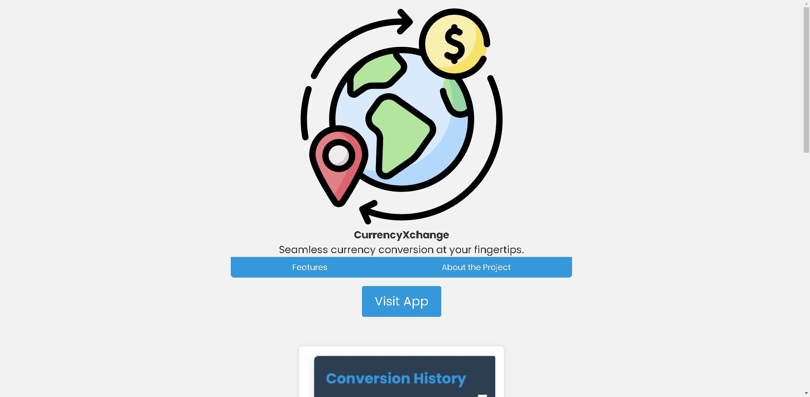
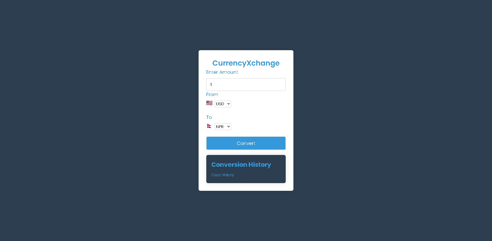

# CurrencyXchange - Bridging Currencies One Conversion at a Time

*Seamless Currency Conversion at Your Fingertips*

## Introduction

CurrencyXchange is not just a tool; it's a story—a story of navigating the complexities of currency exchange, of connecting with the world, and of creating something meaningful. It's born out of the realization that financial transactions, especially across borders, should be seamless and accessible. This project is my journey to bridge currencies, one conversion at a time.

🚀 **Launch CurrencyXchange:** [CurrencyXchange App](https://alantiren.github.io/CurrencyXchange/)
📖 **Read Project's Chronicle:** [Bridging Currencies One Conversion at a Time](https://medium.com/@alantiren76/currencyxchange-bridging-currencies-one-conversion-at-a-time-9ed039aa3900)
👨‍💻 **Author:** [Alan Tiren](https://www.linkedin.com/in/alan-tiren-b59701164/)

## The Journey

### 🌟 Inspiration and Motivation

The spark for CurrencyXchange ignited during moments of frustration—trying to navigate through diverse currencies while helping my brother with funds during his travels. The motivation was clear: create a tool that not only simplifies currency conversion but adds a touch of ease to people's lives, making financial interactions a breeze.

### ⚙️ The Technical Challenge

Building a currency converter isn't just about algorithms; it's about creating an experience. Choosing the right algorithm for real-time exchange rates, crafting an intuitive interface, and ensuring data accuracy posed fascinating challenges. It was not just about writing code; it was about understanding the pulse of users.

### 📆 Timeline and Struggles

Every project has its ups and downs. From grappling with API intricacies to refining the UI for a seamless experience, each step was a dance of learning, experimenting, and iterating. The timeline was a dynamic canvas—a journey of growth and adaptation.

### 🚀 The Next Iteration

While CurrencyXchange is functional, the journey doesn't end here. The next iteration envisions a more comprehensive financial companion. Imagine personalized user accounts, historical trend analysis, and an even more extensive currency database. The goal is to evolve CurrencyXchange into a true ally for users navigating the global financial landscape.

## Technical Odyssey

### 🏛️ Architecture

The architecture follows a symphony of frontend and backend technologies. HTML, CSS, and JavaScript orchestrate the frontend, while the backend harmonizes with the ExchangeRate-API to fetch real-time exchange rates. This dynamic dance ensures users experience swift and accurate currency conversions.

### ✨ Features

1. **Intuitive User Interface:** A design crafted for simplicity, empowering users to swiftly input details and obtain accurate results.

2. **Real-Time Exchange Rates:** CurrencyXchange fetches real-time rates, ensuring users receive the most accurate and up-to-date information.

3. **Conversion History:** A chronicle of user conversions, providing a convenient way to track and reminisce about past financial journeys.

## The Human Touch

CurrencyXchange is more than lines of code; it's a journey of empathy, challenges, and relentless improvement. It's a testament to the belief that technology, when infused with understanding, can make a meaningful impact on people's lives.

## Get a Glimpse

## Installation and Usage

1. For web-app usage, [launch it here](https://alantiren.github.io/CurrencyXchange/).
2. For the Android application, download the APK [here](https://www.webintoapp.com/store/183759).

## How to Engage

- Open your web browser and embark on a currency conversion journey.
- Enter the amount, choose source and target currencies.
- Click "Convert" for the magic of real-time exchange rates.
- Explore the conversion history for a stroll down memory lane.

## Join the Symphony

Feel the urge to contribute? The symphony welcomes you:

1. Fork the repository.
2. Create a new branch: `git checkout -b feature/your-feature-name`.
3. Commit your changes: `git commit -m 'Add some feature'`.
4. Push to the branch: `git push origin feature/your-feature-name`.
5. Send forth your contribution with a pull request.

## Related Harmonies

- [Exchange Currency Calculator](https://github.com/VladimirSaenko/Exchange-Currency-Calculator)
- [Currency Exchange](https://github.com/Subhadip7/Currency-Exchange)

To experience the simplicity of CurrencyXchange, [visit the app](https://alantiren.github.io/CurrencyXchange/). Your seamless currency conversion journey begins here!

## Connect with the Composer

- 
- 
- 

---

**CurrencyXchange is licensed under the [MIT License](LICENSE).**

---

*Feel the rhythm of seamless currency conversion—a symphony composed with empathy and crafted for you.* 🌐✨
